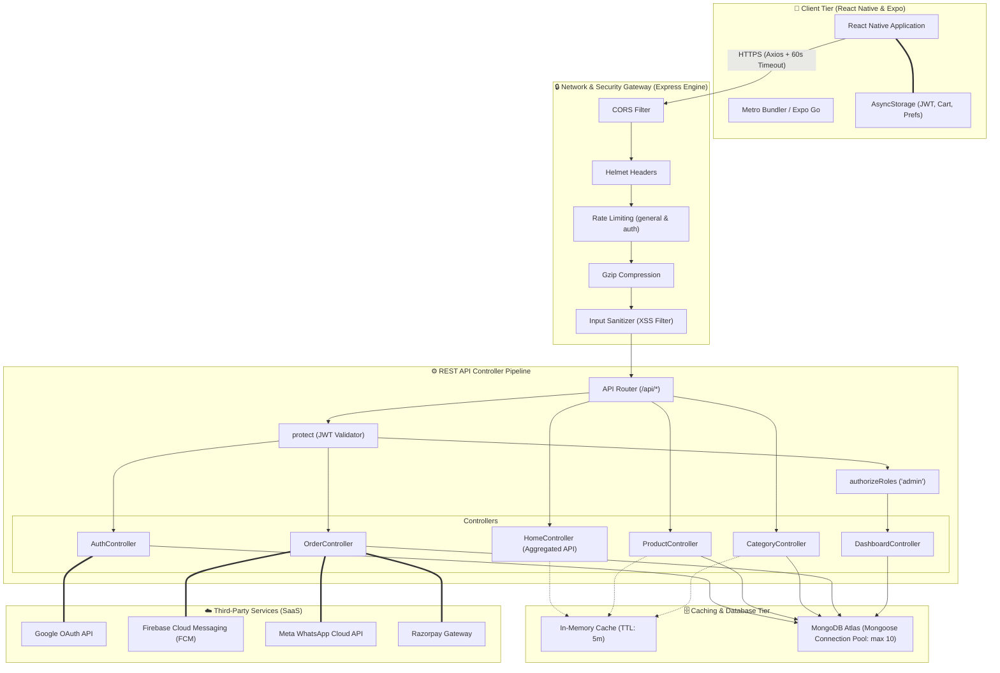
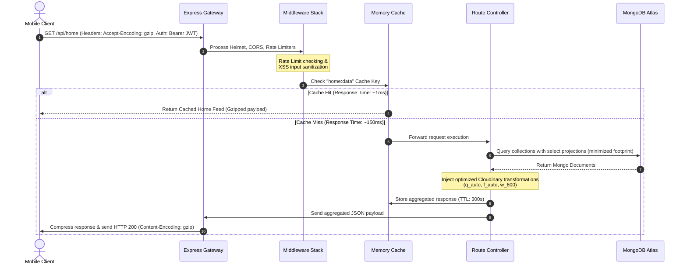

# 🏗️ Tarun Kirana Store (TKS) - System Architecture Specification

This document details the complete, end-to-end technical system architecture, query pipeline execution, security gateways, caching mechanisms, and external integration points of the Tarun Kirana Store platform.

---

## 🗺️ Complete Architecture Topology

The application is built on a standard **Three-Tier Architecture** consisting of a client application tier, an optimized REST API server tier, and a persistent database storage tier, bridged by external SaaS integrations.

---

## 🔄 Sequential Query Execution Pipeline

Every API request follows a deterministic 8-step lifecycle, from client trigger to persistent database query and gzip response delivery:

---

## 🛠️ Step-by-Step Architecture Specifications

### 1. Client Tier (React Native)
* **API Client**: Axios configured in [client.js](file:///Users/surajkumar/Developer/MAIN_PROJECT/E-commerce/frontend/src/api/client.js) with a **60,000ms (60s) timeout** to prevent failures during Render cold starts.
* **Persistent Session Storage**: Store JWT tokens locally in device `AsyncStorage`.
* **State Management**: Context providers ([AuthContext.js](file:///Users/surajkumar/Developer/MAIN_PROJECT/E-commerce/frontend/src/context/AuthContext.js), `CartContext.js`) manage user credentials and basket items across layouts.

### 2. Security & Routing Tier (Express.js)
* **Helmet**: Hardens HTTP headers to block Clickjacking, MIME-sniffing, and cross-site scripting vulnerabilities.
* **CORS Protection**: Allow Cross-Origin resource requests from mobile wrappers.
* **Rate Limiter**: Configures rate ceilings (`max: 100` / 15m for API; `max: 20` / 15m for Auth) to block brute-force and DDoS attacks.
* **XSS Request Sanitizer**: Custom regex filter intercepts `req.body`, `req.query`, and `req.params` to scrub potential script injections and HTML tags.

### 3. Caching & Query Optimization Tier
* **Dynamic Projection**: Avoids generic queries. Uses `.select('id name price discountPrice stockQuantity unit imageUrl')` to extract only required fields, reducing RAM overhead on Mongoose models.
* **Mongoose Pool Manager**: Handled inside [db.js](file:///Users/surajkumar/Developer/MAIN_PROJECT/E-commerce/backend/src/config/db.js):
  * `maxPoolSize: 10`: Reuses DB connections to prevent database socket starvation.
  * `minPoolSize: 2`: Retains persistent active sockets to avoid connection delays.
* **Memory Cache**: [cacheService.js](file:///Users/surajkumar/Developer/MAIN_PROJECT/E-commerce/backend/src/services/cacheService.js) stores key-value objects in memory. It uses pattern invalidation (e.g. `clearPattern('products:')`) to empty outdated product feeds whenever an administrator triggers write commands (`POST`/`PUT`/`DELETE`).

### 4. Integration Tier (SaaS Engine)
* **Razorpay Webhooks**: Verifies signatures of incoming payment callbacks before editing order states from `pending` to `completed`.
* **Firebase Admin Admin SDK**: Dispatches real-time transactional push notifications via Firebase Cloud Messaging (FCM) using stored user `pushToken` keys.
* **Meta WhatsApp Cloud API**: Sends automated notifications (order status confirmations, tracking numbers) using WhatsApp transactional message templates.
